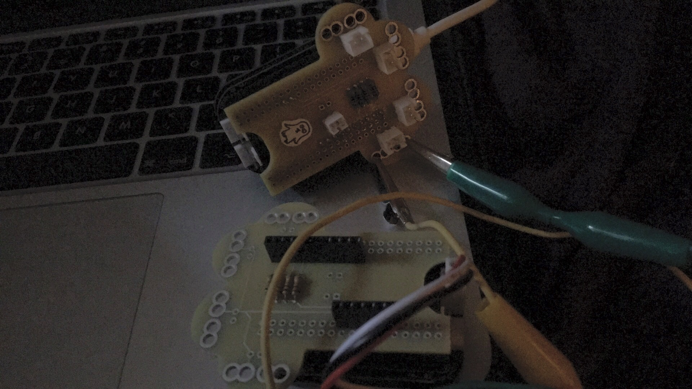

# Instrument Maker

This is an open source framework for digital instrument building with sensors, with improving access in mind. For [Pure Data](http://puredata.info/) running on [Bela](http://bela.io) / [Raspberry Pi](https://www.raspberrypi.org/) + [Arduino](https://www.arduino.cc/).  Code developed by [Charles Matthews](http://ardisson.net/), with workshops currently in development in collaboration with [Gift Tshuma](http://www.utchoir.com/) and more in the pipeline.  Get in touch if you would like to contribute!

Distributed under the terms of the **GNU Public license version 3** (for now  / not sure how appropriate to this project / need to read up on this).

## Disclaimer

Instrument Maker is one of my first public repos, and will definitely be messy for a little while. I'm relatively new to Open Source culture - please call me out and/or help me understand if you disagree with anything on here.  Same goes for Disability and accessibility issues. 

This document in itself is a work in progress, and an invitation to conversation.  At present, I'd rather have a long page with all the thinking visible, than try to break it up into hidden sections.  If this causes problems in accessing the material, please get in touch and I will gladly provide you with an appropriate alternative until such a time that I can provide more general options.

About the code: the current version is not ready for public consumption (see the technical notes below); please feel free to explore the code, and download and try out the abstractions if you are familiar with Pure Data..but I recommend waiting a little while until everything's more coherent.

## How does it work?

Within Pure Data (pictured below), create objects with the `im.` prefix to access building blocks: e.h. inputs, outputs, tuning systems, and synthesisers. Alternatively, download an example from the repository. Upload to Bela, or Raspberry Pi with an Arduino-type device connected.  

With Bela, choosing a setup should be a case of dragging and dropping into a browser; the Pure Data files can exist as templates or presets, no need to edit or look at the code unless desired.

Video demo (code): https://youtu.be/8AJMJq2P8Ko

Video demo (mobile): https://www.youtube.com/watch?v=jl020N0MZxk

Video demo (play): https://www.youtube.com/watch?v=ywEX0N6TpEA

An accompanying hardware component is in development, which adds crocodile clip access to the Bela platform.

## Background

My intention is to help find a different entry point to instrument creation using sensors.  Access to this is not currently good enough.  Not just within a Disability context, but that's where the focus sits for this project. 

I'm reluctant to use the term "Accessible Music Technology" to describe this project; while I respect others that do, I don't currently think it's all that helpful a label in abstract. I do hope that this will form a move toward "Disabled artist-led music technology": essentially the same idea, but implying a different power relationship.  Having said that, AMT is certainly a context in which some of this project's output will fit. Access or accessibility tend to rely upon openness, and benefit from opportunities for input at every stage of the design process.

So, ideally, this should provide an opportunity/context for someone to approach the problem of creating an instrument, rather than (necessarily) learning a programming language. Conversely, it shouldn't remove access to the underlying code..whether that's through a nicely packaged GUI, or a closed source back end. That's not necessarily the easiest problem to solve!  We're starting to see a bit more of this approach appearing in commercial software; [Max for Live](https://www.ableton.com/en/live/max-for-live/) is a good example.

### Access barriers

What are the barriers to creating digital instruments? What would we call the disabling barriers; i.e. those imposed by society, which place responsibility on an individual to act or change oneself based on a difference or impairment?  

Here are a few that I can think of - would love to have more conversations around this:

- Cost of resources 
- Physical access: assumption of appropriateness of specific interfaces
- Ways to access information
  - Limited formats (e.g. absence of text, screen reader compatibility/audio description, or symbol-based option, pacing of information)
  - Assumption of prior knowledge, cognition, access to education 
- Noise! Long, abstract steps to set up, menus that distract from interactions, the lure of multifunction devices or software
- Diversity in the representation of creators and artists
- Unstable systems (e.g. operating systems that herald new accessibility features but break music software when updated)
- Lack of compatibility with other frameworks that provide access

What so much of this boils down to: lack of options, lack of openness, *the lack of ability to change things and lack of appropriate pathways to learn how*.  

I believe that most of the above applies as much to the creation of resources as it does to consumption. In fact, making a distinction between these acts might be considered problematic in this context.

### Access in workshop settings

In my experience, teaching environments, including less formal workshops, are often quite polarising environments when it comes to expectations of screen-based activity.  A room with a set of consoles can be a welcoming space for some people, but excluding for others. Throw some audio into the mix, and it becomes very difficult for a facilitator to keep track of the different levels of progress in the room.

So how could we make the resources more visible, and collaborative? Although environments like Pure Data might be an ideal way in to audio programming, they do rely quite heavily on focused attention on a screen, and moving between keyboard and mouse. This feels quite jarring compared to contemporary standards of touch-screen based activity (including smartboards).  Furthermore, with a single fixed method of user input, many people without access to these interfaces are excluded.  

### Feedback from early tests

Excluding generic positive feedback: a couple of things that have jumped out so far from the initial demos and videos:

**Feb 2019**

- I think I get a bit intimidated by the form, I often feel like, "how am I supposed to remember all these names?" also the scales and stuff scared me. But that would make more sense to a musical crowd.
- how would I save all the presets?
- at the start that you were effortlessly editing it and I was struck that I wouldn't know what to do. But this is common to max and pd tutorials. So not specific to you. It's what has generally scared me off. Just not knowing the language and not seeing easy ways to get to grips with it, I mean it might be naive of me but when looking at code written out the meaning has always seemed more accessible. You can get a sense of what each part is doing to each other.

### A few considerations in the initial development

Would everyone like to make their own instrument? Does everyone need to? Is it a good use of time?  It's up to the individual to make an informed decision.  But the options should be on the table.  With this in mind, here were a few considerations as I put the first demos together:

- remove obligation to code, but with opportunities to learn and dismantle 
- offer ways to create objects that feel like instruments, rather than controllers: devices that have a direct, local connection between physical input and output, without mediation from a keyboard and mouse (and added costs on that front)
- retain ability to make complex, difficult-to-master instruments
- options for expression beyond pitch, duration, and loudness by default; music is about more than playing notes and chords (obvious maybe, but an "AMT" approach doesn't always look beyond this)
- integrate a variety of tuning systems
- expand access through ability to modify and create derivatives.

### What's Pure Data, why use it this way?

Pure Data is a free, open source, visually oriented programming language. This is also known as dataflow ("the diagram is the program"): on-screen boxes that serve particular functions are joined together, sending messages back and forth, some of which can be sound, which eventually gets sent out to speakers or other things in the physical world.  For musicians, this can fit neatly with familiar notions of arranging mixers, modular synths, and effects pedals, or throwing objects at a drummer to negotiate tempo.

It's not a million miles away from the ["blocks"](https://en.wikipedia.org/wiki/Block_(programming))-type programming currently popular in education, either. I'm interested in how Pure Data can be used in a similar way, but without the complexity of trying to make everything from scratch: getting caught up in "spiders' webs" or a blank screen on day one, or feeling turned away by assumed knowledge of maths etc. — which are the experiences I often observe when teaching this, and reflect my own first steps. One of the beautiful things about Pure Data and similar environments is that they facilitate an exploratory, "let's see what happens when I plug this thing into this other thing" approach.  But we need a good way into that. 

*This is where it gets a bit ranty and controversial, so please bear with me:* the idea that we need to identify as "technically-minded" to access these materials can tacitly reinforce power structures, including but not limited to those formed around Disability. I don't mean to suggest that this is a status or identity that cannot be occupied, but rather that to be labelled as "technically-minded" (or not) often implies access to resources and education from which many people are excluded - in contrast to an inherent aptitude. Not to suggest that everyone wants to create music or instruments at this level either..but why mention this here? 

Among the many options for creating bespoke software, even compared to some text-based languages, Pure Data arguably falls within the more "technical" camp.  With less emphasis on graphics than software like Max, it's a bit more like moving code around than re-plugging guitar pedals.  And it pushes the user into more "code-like" thinking. That's a positive thing in my opinion, but not always the most inviting situation at the start for someone who has hitherto been excluded from these situations.  Furthermore, by engaging with this situation, there is a common problem in that assuming a lack of engagement with technology often implies a need for simplification.  Although there are less ready-made options with tangible musical outcomes to use as a starting point.. once we can find or create the right ones, the experience, the underlying principles, the learning curves, can be similar to other more "accessible" forms of code.  Much like finding ways to teach and learn a musical instrument.

*(And... relax..)* These days, you can find a way to run Pure Data on pretty much anything, within reason: as well as current versions of Linux/Raspbian, Windows, and Mac OS, the most recent version (apparently) still supports Windows XP and Power PC Macintoshes. Libpd and Heavy provide ways to embed it in mobile apps and the web. Not to mention platforms like Bela, which have seen a shift from developing controllers to affordable, portable sensor-based instruments with low latency, and localised sound.

There is an active online community with [forums](https://forum.pdpatchrepo.info/) and a [Facebook group](https://www.facebook.com/groups/4729684494/), where it's possible to discuss problems and ideas.

### About [me](https://twitter.com/matthewscharles) 

I don't identify as a coder, much in the same way that I sometimes don't feel entitled to identify as a musician (I don't know wtf it is I do tbh) but I care enough about this kind of stuff to want to make it.   Plus I have [pretty intense ADHD](http://ardisson.net/a/?p=363)/executive function issues, and find it difficult to let things go.  I wasn't able to complete a secondary school education, and I had to abandon maths and physics, I think mostly due to a lack of concrete context. I had to bash my head against the wall a lot to break into writing code, and still feel like I am missing some fundamental knowledge.  My way into coding was through Max, and later Pd, not because of a desire to engage with technology for its own sake (ok, perhaps if a love of weird noises counts), but because I was dissatisfied with the mainstream tools available, and consistently met people who felt the same way.  I jumped into teaching with these resources quite early on; I failed hard quite a lot before learning the importance of dialog and a solid framework to work through. Through all of this, technology became an invaluable tool to communicate. 

I know that most of what I make could be used by other people, but it's been lacking some sort of unifying practice and documentation. I have certainyl engaged in [openwashing](http://openwashing.org/) in the past, and probably still do so, consciously or otherwise. Not that I believe everyone should be forced to do this...as terrifying and perhaps unneccessary as the idea of making a process like this open, before it's properly organised, might be, I'm tired of hiding projects away, of worrying about competition. I'm equally tired of saying "it'll be open source down the line/when it's tidier/when I know that I can support it". That latter part could be problematic. But that's what reaching out to a community is about, right?

Instrument Maker pulls together material from around fifteen years of lectures, collaborative projects, and artistic output (e.g. [Light Recorders](http://ardisson.net/a/?page_id=440) and [Augmented Gamelan](http://augmentedgamelan.com)).  I'm excited to think that this might form the basis for some much wider collaboration.  Portions of this work were developed with the support of [Drake Music](https://www.drakemusic.org/): e.g. [the Kellycaster](https://rockinpaddy.wordpress.com/) with John Kelly, Gawain Hewitt and others, [DMLab innovation challenges](http://music.britishcouncil.org/news-and-features/2016-10-20/embracing-music-technology-the-dm-lab-challenge), and the [Planted Symphony installation](http://www.drakemusic.org/our-work/artistic-development/projects-commissions/planted-symphony/). Also [instrument building](https://www.youtube.com/watch?v=u2jbe-UZWwo) projects at [Wac Arts](https://www.youtube.com/watch?v=khgLvs59AlU).

Some of this code was originally developed for Max/MSP, and can possibly be made available on request; it's a bit much to develop on the two platforms in parallel right now.  This sits alongside a couple of other projects that live in other repositories: the [Light Recorder Deck](https://github.com/matthewscharles/Light-Recorder-Deck) (for affordable [DMX light control](https://twitter.com/Josonia7/status/1093481504372654080)), and an Accessible Music Technology Framework (an Arduino library with similar aims, currently on hold).  

### Where are the problems with this approach?

This kind of situation can be restrictive, presumptuous, perhaps even patronising. Is this an attempt to define other people's access? An unnecessary simplification?

One of the advantages of working with Pure Data, or similar languages, is that the graphical interface can automatically be part of the code. Many of the musical interfaces we are used to now are more abstract versions of this; see, for example, the drag-and-drop plugin chaining and less-linear-timeline-based interactions that were popularised through [Reason](https://www.propellerheads.com/en/reason) and [Ableton Live](https://www.ableton.com/en/), the latter of which was ~~[originally prototyped in](http://www.roberthenke.com/technology/ableton_live.html)~~ partly inspired by Max.

On a practical level, my own experience of working with similar frameworks (such as the excellent [BEAP](https://www.ableton.com/en/blog/beap-powerful-modules-max-live/) and [Vizzie](https://cycling74.com/articles/introducing-vizzie) collections for Max) has been mixed. They tend to be a little idiosyncratic and difficult to mix with more generic approaches in teaching environments, due to a need for standardised ins/outs and ranges..I can certainly see this as a problem here.

In this proposed framework, in a way, we leave that idea behind; we might test the ideas on screen, with a mouse or keyboard, but that affords certain sorts of interactions..and the act of trying to create a useable interface in itself often leads us back into those spiders' webs.."screen time"..in a way, at this point at least I guess this is less about the playful exploration through code that we might associate with this kind of dataflow/visually oriented setup - but I believe it can lead to more play at the instrument end.  Of course, you may notice some similarities between these objects and the kind of abstractions found in live coding environments like [Tidal Cycles](https://tidalcycles.org/)..there could be an interesting live-patching spinoff to explore.

### How will people be able to access this / how can I contribute?

It's taking time to package this up in a way that is immediately accessible to more people, without optimising prematurely. For now, I am working with a few collaborators on example projects, and posting video updates when I can, which should at least indicate how it works.  

The code has been tested in some shape or form through workshops and lectures for the last five years, and this remains the most immediate way to try ideas and get direct feedback. Face-to-face interactions are good, but not always accessible nor desirable to everyone..so I'd be up for speaking about how this could also happen long distance (with an optional emphasis on mobile devices rather than physical making).

Once the framework is stable, I will start releasing some packaged examples, video tutorials and "worksheets". At this point it may be possible to make a more open call for collaboration on the underlying framework.

I also have plans to release paid some paid apps to support development of the project, which will not require editing of the code in the same way, but which should ideally be re-creatable with the resources we put online.

#### Where can I learn Pure Data?

Just to clarify: *you don't need to know how to use Pure Data in order to use this framework*. But here are some good resources for when you want to move on:

- http://www.pd-tutorial.com/
- http://aspress.co.uk/ds/pdf/pd_intro.pdf

As a longer term goal, I hope to find ways to make a smooth transition from using the framework by itself to unpacking some of the boxes and working more independently (or combining them with existing, more generic approaches).

#### What's an abstraction? And why not just say "object"?

In simple terms: something that performs a certain function, that is enclosed in a way that frees us up from thinking about how it works. 

This thing has certain parameters that we can play with, so when we make one, rather than opening it up to mess with the insides, we can give it some information to determine how it responds to our interactions.

- [A general definition for computing](https://www.youtube.com/watch?v=L1-zCdrx8Lk)

- [What this means in Pure Data and similar dataflow situations](https://guitarextended.wordpress.com/2012/01/12/tip-use-abstractions-and-sub-patches/)

We could make an analogy with a guitar here. We don't need to know exactly how it works if we just want to pick it up and strum it for the first time.  We don't need to know the physics of how the strings vibrate to tune it and make a chord (well, maybe that's a personal choice, but growing up, I was more interested in how the sound made me feel).

When we set the guitar up, we need to give it some information, e.g. by turning the tuning pegs to a certain set of notes.  We probably only need to do that once.  That affects how we play down the line (the fretting, picking, or messages that we send in, all in relation to what we expect to come out).  Within Pure Data, the way we set up those tuning pegs could be called "arguments".

The difference between abstractions and objects? In practical terms within Pure Data…*abstractions* are made from re-combining visual code, so that they can be opened up, modified, and studied by anyone within the main program, and *objects* are coded in C, in which case we're probably going to need an afternoon and a strong drink of some description to get started.  They can be treated in roughly the same way, but using external *objects* gets messy when we try to move between platforms (for example, trying to run the same setup on a Bela Board or an iPhone).

### Are there other projects like this?

Yes! I am definitely not the first person to do something like this. I'm drawing on the work of others, paticularly ideas from live coding and embedded computing.

Not all dedicated to creating standalone instruments in this way (and by no means intended to be exhaustive), but you might like to check out some of these different angles on similar issues within the open source community:

- http://automatonism.com/
- http://www.jamoma.org/pd/
- https://tidalcycles.org/
- https://www.ableton.com/en/blog/beap-powerful-modules-max-live/
- https://github.com/dktr0/estuary
- https://www.drakemusic.org/blog/becky-morris-knight/making-instruments-in-the-classroom/
- https://www.chrisballprojects.co.uk/sensilo-2/
- https://sonic-pi.net/
- http://instrumentslab.org/research/accessible-instruments.html
- https://www.bareconductive.com/shop/touch-board/
- and of course http://blog.bela.io/

# Technical notes

At present, I anticipate that in order to use this framework effectively, you'll need to download an SD card image for a Bela or Raspberry Pi (available soon). This is in part due to reliance on external libraries, which would need better documentation to install from scratch. Furthermore, on the Raspberry Pi, we'll need to set up instructions to boot directly to the software.

For the time being, the "source code" is available here.  If you want a disk image to test, just let me know.  Version control is kind of limited due to the nature of Pd files, but I'm trying to break it down enough that we can observe changes in units/abstractions.

## Interaction with sensors

Pure Data running on Bela is a thing of beauty: sensor inputs are treated as audio information.  Analog inputs are accessed through the `[im.input]` abstraction (with an argument matching the analog input), and connected directly to a virtual instrument.

At present, the most flexible way to recreate this experience with a Raspberry Pi (also a thing of beauty, in its own way, and a bit cheaper) appears to be through an affordable Arduino board running [Firmata](https://www.arduino.cc/en/reference/firmata). In practical terms, this requires dropping in an `[im.firmata]` object, which tells the `[im.input]`objects to look at Arduino inputs rather than the Bela's audio ADC.

I have code hidden away somewhere that works with the [Bare Conductive Pi Cap](https://www.bareconductive.com/shop/pi-cap/), and the Touch Board is a great way to get MIDI in quickly and easily.

Otherwise, the [kviky](https://www.kickstarter.com/projects/18932239/quickstarter-kviky-easy-audio-prototyping-for-rasp?ref=ksr_email_backer_survey_confirmation) also looks like an interesting solution. Hoping to test this when I receive mine next month.

### What about sensors that communicate over I2C, the HSR-04 etc?

I don't understand how to do this natively with Bela yet, but maybe that's something to work out down the line.  Going through an Arduino would be fine. Unsure about Firmata here, my preference is usually to work with an ATmega32U4-based board and send MIDI over USB, which we can guarantee to pick up in Pd Vanilla.

### Can it process audio input and sample?

Yes, but not yet in the examples I have uploaded so far.

### Interaction with actuators?

No reason not to, and my initial attempts included a lot of this! But focussing on audio output keeps it simple, sort of, for now.  

### MIDI output/what if I just want to make a controller?

As above..but there are lots of great things that do this already, and this was the focus of the accompanying AMT Arduino library.

### What about output to my modular or similar CV/gate synth?

[Ok, I'll make an exception](https://twitter.com/matthewscharles/status/1096605603579990016) ;) since this is all running at audio rate, this can integrate quite nicely. People do this with Pure Data (and Bela) already.

## Pd: example objects/abstractions in first demo

| Name                             | Vanilla? | Needs (easy fixes in italics)                                |
| -------------------------------- | -------- | ------------------------------------------------------------ |
| `im.generatescale`               | y        |                                                              |
| `im.input`                       | y        |                                                              |
| `im.key`                         | y        |                                                              |
| `im.midiin`                      | y        |                                                              |
| `im.output`                      | y        |                                                              |
| `im.reverb`                      | n        | freeverb~ (yeah, I cheated for now)                          |
| `im.sample`                      | y        | -                                                            |
| `im.scala` & `scala2` (internal) | n        | *counter*, *gate*, *tosymbol*, *fromsymbol*, zl: *iter*, *group*, *len*, *join*, sect, *reg*, *rev* |
| `im.scale`                       | n        | zl: *reg*, *len*, *lookup*                                   |
| `im.sensor`                      | y        |                                                              |
| `im.tunedperc`                   | n        |                                                              |
| `im.tuning`                      | n        |                                                              |

## Tuning/Scala

*Please note: if you got as far as reading this section, there's a possibility that I don't care about microtuning as intensely as you do.  I can dig that. Think I'm mishandling this stuff? Let me know :)*

The framework uses the [Scala](http://www.huygens-fokker.org/scala/) format to retrieve tuning systems, which may be useful for storing scales as well.  This could fit into (or replace) JSON as described below.

Tuning is transferred to a table accessible at audio rate with interpolation if needed (I think this has potential for some subtley freaky modulation sources).

## Reliance on Cyclone library/ current todo list

I would like to make this available to work on [Pd Vanilla](https://stackoverflow.com/questions/14793956/is-there-any-reason-to-use-vanilla-pure-data-instead-of-pd-extended), to simplify the installation procedure and ensure compatibility with [libpd](https://github.com/libpd)-based contexts, e.g. [MobMuPlat](http://danieliglesia.com/mobmuplat/). At present, I use the [Cyclone](https://github.com/porres/pd-cyclone/) library as this makes Pd a lot more accessible to me coming from a Max background.  

I'm looking for ways to recreate the following objects using Vanilla.  Since the addition of new list functionality, some of this is more about breaking out of old habits, so I'll include this as something of a todo list for now.  *Can probably move a couple of the remaining tasks into issues.* I guess it could form part of a useful resource for Max heads in the future. 

- **zl**: I'm pretty sure that all of the below can be handled with the generic list object, but some of these operations desperately need encapsulating
  - I've created a `[for]` object (with argument ++ or --), which takes in a list or integer to create a for loop based on the input/length..this makes patching a bit nicer and a bit more like text-oriented code
  - **zl reg**: more specifically, I use this to retrieve a symbol-based argument within an abstraction. Works fine with `[list store]`
  - **zl group**: (a bit more than) just `[append]` and bang
    - fixed by creating `[list.group]`
  - **zl join**: `[list append]` or `[list prepend]`
  - **zl lookup**: like `[list store]`, with a `get $ 1` message
  - **zl len**: `[list length]`
  - **zl sect**: `[list split]`? — not quite, need to compare..this is the sort of thing that usually gets quite complicated/frustrating in Pd.
  - **zl iter**: recursive `[list split]` with `[until]`? — see serialization example (3) in the help file
    - solved by creating `[list.iter]` - takes argument ++ or -- to iterate up or down through the list (only one entry at a time at present)
  - **zl rev**: probably a combination of `[list split]` and `[list prepend]` as above with iter
    - solved by creating `[list.rev]`
  - **zl rot**: as above
    - solved by creating `[list.rot]`
- **gate** and **switch**: with arguments for multiple inlets/outlets..and that'll mean a bit of scripting. should be ok (I did this loads in Max some time ago, how hard can it be?) but might need to establish a reasonable maximum number.
  - Doesn't seem possible after all, since the examples I've found only take script into sub-patches (or is it possible, knowing the name of the file? e.g. ;pd-testfile.pd obj 200 200 outlet..no!! We start bringing in temporal paradoxes and parallel universes).
  - Perhaps better to prepend indices and route.
- **tosymbol**: is it really just a case of `[list prepend symbol] -> [list trim]`? Or is this stuff actually useful after all? Switching between types in Pd has been a thorn in my side..
- **fromsymbol**: this one is potentially tougher..maybe I don't yet understand how symbols and lists are processed differently in Pd yet.
- **counter**: should be easy enough, certainly the way I use it here..in fact I'm starting to prefer the old-skool float and plus. Pd 101 with added arguments. Also created `[for]` which takes care of a fair bit of the non-realtime counting I need.
- **rampsmooth~**: ugh..this one will be tough to live without, I use this for everything. Maybe look at [source code](https://github.com/porres/pd-cyclone/blob/master/cyclone_objects/binaries/audio/rampsmooth.c) and use something like `[fexpr~]`? I've got as far as some if statements with `$x1[-1`], love it so far.
- **svf~**: unfortunately this is an easy way to make filters with audio modulation inputs that will be similarly difficult to let go.
- **scale**: I think this should be `[expr ($f1 * (($f5 - $f4) / ($f3 - $f2))) + $f4]` but it doesn't handle negative numbers. There was an abstraction included within pd-extended that I'd like to check out.
  - the abstraction was actually from jamoma: `expr ($f1-$f2)*($f4-$f5)/($f2-$f3)+$f4` - this handles negative numbers ok.
  - created `[im.map]` using the above.

Interested in using some Max-style attributes…some potentially useful info [here](https://forum.pdpatchrepo.info/topic/10892/collect-all-arguments-as-a-list/7).

## JSON file format

I'm keen for this to use the JSON format to promote compatibility with other platforms. I use the PuRestJson external available for Pd, which works OK. Considering writing a parser with Vanilla objects, but really, is that going to end well?  

Update: yes, turns out that the `[text]` object is great for this!! Nested structures now working in read mode (still a bit hacky), haven't attempted to format and write a JSON file yet.  The search function looks like it could be quite powerful.

## Message format

This is one of the hardest aspects of this project.  Do we use a mixture of audio and control-rate objects, or try to go exclusively down one of these paths?

My preference is to use as much audio as possible. Using tables helps this a lot.

The main problem is that symbols are important to access (e.g. having the option to put in note names, chords, etc. the way they would usually be written in the outside world).  In designing for the glorious audio-rate sensor inputs available via Bela, we sometimes have to do a bit of conversion across to control rate, in order to access things like arrays of symbols, or if restricted to audio, have a division on a touchscreen fader re-trigger a specific chord.   My experience is that can cause problems - but I don't really understand mode switches yet, for example.

I'm curious as to how other people have approached this situation..perhaps a question to put to the Bela team.

*Note to self - maybe the mobile-compatible objects could briefly drop to a negative signal to signify "change"*

## Accessibility/misc documentation

- Some instructions involving the help browser could be useful, as could Henri Bisognini's autocomplete plugin.
  - The creation system in Automatism is good, but personally I'd rather avoid starting from a template in order to create the items automatically.

- How do we make this screen reader compatible?

- How could we make a symbol-based version?

### Graph on parent

To use or not? Maybe I should fork and try it..

**Pros:**

- Can address some access concerns around contrast, possible colour coding if possible to work out an appropriate panel-like GUI oject.
- Less confusion around differentiation from built-in objects
- Will not open accidentally on click
- Can label outlets and display input meters (*big* advantages here)
- Customisable colour scheme from a central file on load

**Cons:**

- Adds time to object maintenance (so maybe this is something for down the line, once settled?)
- Drawing issues (yeah, now I remember why I have steered away from these)
  - Sub-canvas is automatically drawn over the name of the object, so we need a white space at the top
  - Similarly, need white space of a pixel height in order to display outlet
  - Only one sub-canvas available to draw at a time
  - User resizing canvas breaks design (since extending the sub-canvas resizes the entire representation in the main patch)
- Could get clunky if size gets too large (and they seem to be automatically resize-able by the user)
- Harder to represent on Bela's web-based interface etc.
- Possible conflict with font sizes?

### Other useful stuff

- https://forum.pdpatchrepo.info/topic/10258/loading-a-pure-data-patch-pd-file-within-a-pure-data-patch-pd-file/16