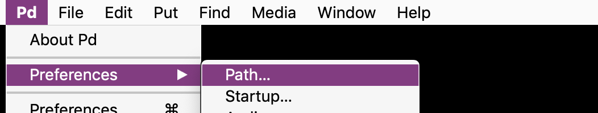
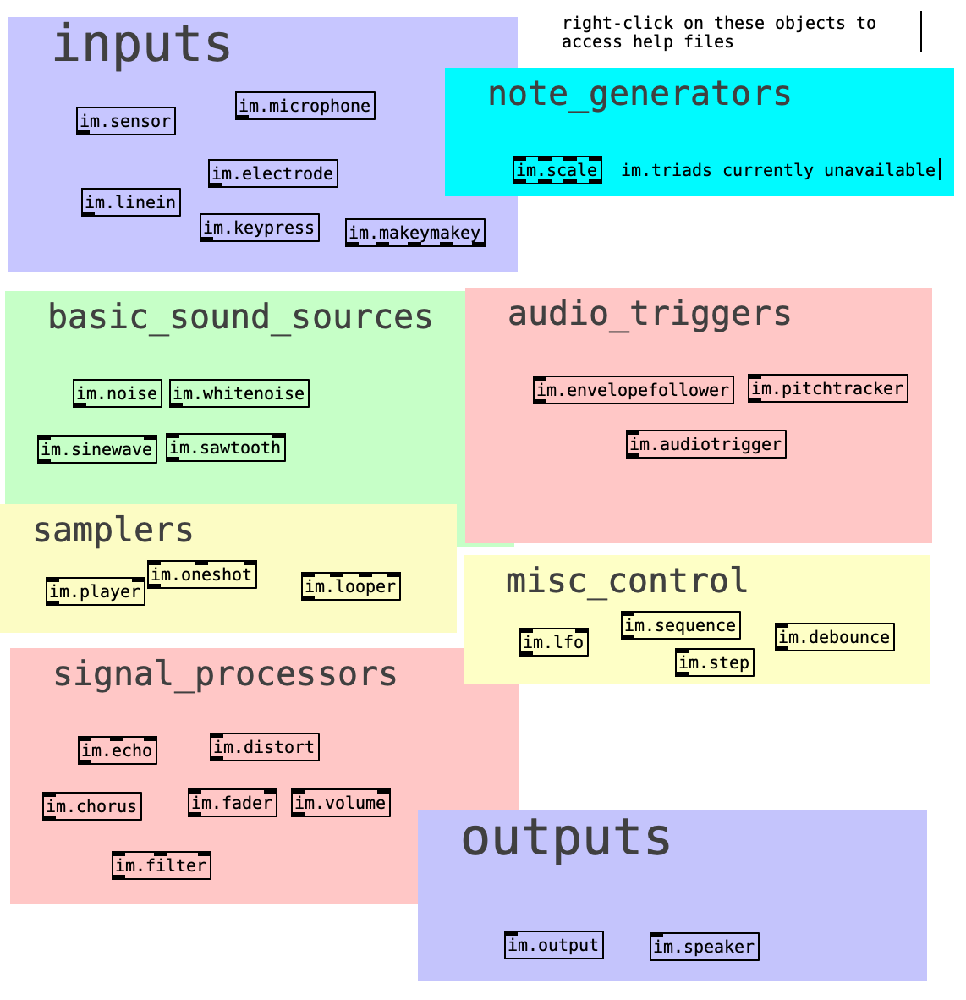

# Instrument Maker

This is an open source framework for digital instrument building with sensors, with improving access in mind. For [Pure Data](http://puredata.info/) running on [Bela](http://bela.io) / [Raspberry Pi](https://www.raspberrypi.org/) + [Arduino](https://www.arduino.cc/).  Code developed by [Charles Matthews](http://ardisson.net/), with workshops currently in development in collaboration with [Gift Tshuma](http://www.utchoir.com/) and more in the pipeline through our new project [Blurring the Boundaries](http://www.blurringtheboundaries.org/).  

An accompanying set of communication symbols can be found [here](https://instrumentmaker.org/instrument-maker-symbols).

<!--Some rough documentation is being generated here: <https://instrumentmaker.org/im-reference/>.-->

[**Introductory document (work in progress)**](https://github.com/matthewscharles/instrument-maker) 

---

Read about the philosophy behind this framework at the Bela.io blog: <https://blog.bela.io/2019/08/20/towards-disabled-artist-led-music-technology-charles-matthews/>

This document in itself is a work in progress, and an invitation to conversation.  [**Please access the wiki for more information and development notes.**](https://github.com/matthewscharles/instrument-maker/wiki)  

Distributed under the terms of the **GNU Public license version 3** (for now  / not sure how appropriate to this project / need to read up on this).

## Disclaimer

Instrument Maker is one of my first public repos, and will definitely be messy for a little while. I'm relatively new to Open Source culture - please call me out and/or help me understand if you disagree with anything on here.  Same goes for Disability and accessibility issues. 

About the code: the current version is not ready for public consumption (see the technical notes below); please feel free to explore the code, and download and try out the abstractions if you are familiar with Pure Data..but I recommend waiting a little while until everything's more coherent.

## How does it work?

To program: within Pure Data (pictured below), create objects with the `im.` prefix to access building blocks: e.h. inputs, outputs, tuning systems, and synthesisers. Upload to Bela, or Raspberry Pi with an Arduino-type device connected.  

Using Bela, choosing a setup should be a case of dragging and dropping into a browser; the Pure Data files can exist as templates or presets, no need to edit or look at the code unless desired.

<!--An accompanying hardware component is currently under development, which adds crocodile clip access to the Bela platform.-->

<!---->

----

# Current demo setup

We are currently focusing on Raspberry Pi/desktop but will be updating with instructions for Bela again soon (including the new IDE).  For anyone interested in trying the demo:

- Clone the repo to a local folder by opening a terminal: 

  - `git clone https://github.com/matthewscharles/instrument-maker`
  - On a Mac, you might be required to download developer tools. Note: there is no need to install Xcode.

- Install [Pure Data](http://puredata.info/downloads)

  - On a Mac, you may need to right-click on the downloaded application to run it.

- add the instrument-maker folder to the search path in Pure Data

  

  

- look for im-current-objects.pd in the learning-examples folder

- right-click on the objects found here to open help files.  make sure you press ctrl-E to enter edit mode!

Keep up to date by typing `git pull` within the folder in terminal.