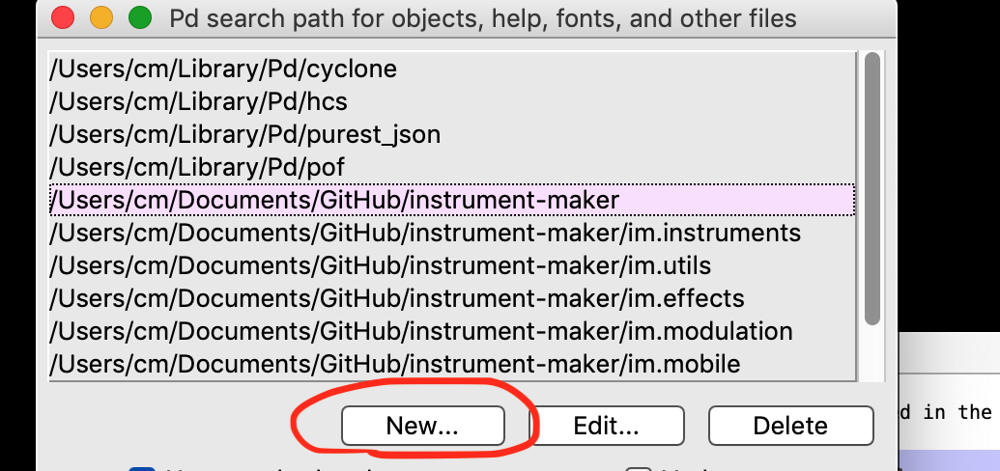

**Instrument Maker** is an open source framework for digital instrument building with sensors, for [Pure Data](http://puredata.info/) running on [Bela](http://bela.io) / [Raspberry Pi](https://www.raspberrypi.org/) + [Arduino](https://www.arduino.cc/).  

<!--Some rough documentation is being generated here: <https://instrumentmaker.org/im-reference/>.-->

- [**Learning Pd through Instrument Maker**](documentation/manual/learning-pd-through-im.md) (work in progress)
- [**GitHub repo**](https://github.com/matthewscharles/instrument-maker/)
- [**Instrument Maker Communication Symbols**](https://instrumentmaker.org/instrument-maker-symbols/)
<!-- - **[Education Makers version](https://github.com/educationmakers/instrument-maker)** (development in an education technology context with Milieux Institute). -->

<<<<<<< Updated upstream
Distributed under the terms of the **GNU Public license version 3**.

The code is developed by [Charles Matthews](http://ardisson.net/), initially through workshops in collaboration with [Gift Tshuma](http://www.utchoir.com/), and with more in the pipeline through our project [Blurring the Boundaries](http://www.blurringtheboundaries.org/).  

Many thanks to [Roybn Steward](https://www.robynsteward.com/music) and [Dave Darch](http://alittlelearning.org/) for testing the code in workshops and helping generate documentation.

---

Read about the philosophy behind this framework at the [Bela.io blog](https://blog.bela.io/2019/08/20/towards-disabled-artist-led-music-technology-charles-matthews/).

[**Please access the wiki for more information and development notes.**](https://github.com/matthewscharles/instrument-maker/wiki)  

## Disclaimer

Instrument Maker is one of my first public repos, and will definitely be messy for a while.

Please feel free to explore, and download and try out the abstractions if you are already familiar with Pure Data..but I recommend waiting a little while until everything's more coherent.
=======
# About Instrument Maker

Instrument Maker is a tool for rapidly creating what is often described as accessible music technology (AMT), by using established programming languages and affordable hardware to create standalone instruments.  Its parameters have been chosen to reflect the options usually requested in music workshop settings: 

- quickly assignable musical scales/keys 
- flexibility around root notes and available ranges of notes
- chords 
- sampling 
- input from a range of interfaces such as distance sensors and switches
>>>>>>> Stashed changes

## How does it work?

The main resource is an library of objects for [Pure Data](http://puredata.info/).

Having downloaded the library, create and connect building blocks in the form of obects with the `im.` prefix: e.g. inputs, outputs, tuning systems, processors, and synthesisers. Upload this code to Bela, or use a Raspberry Pi with an Arduino-type device connected.  

Using Bela, choosing a setup should be a case of dragging and dropping into a browser; the Pure Data files can exist as templates or presets, no need to edit or look at the code unless desired.

----

<<<<<<< Updated upstream
# Current demo setup
=======
# Installation

***This is for our current demo setup for desktops/RPi. Deken release coming soon!***

We recommend using [Patchbox OS](https://blokas.io/patchbox-os/) for Raspberry Pi installations - once installed, follow the instructions below.

## **Recommended: download release**

Download the latest release here, decompress somewhere in your user folder and follow the instructions for installation. 
https://github.com/matthewscharles/instrument-maker/releases

- Optional Bela download

The stripped-down Bela release is meant to function alongside the main library. Install the im folder as usual, and upload this folder with your _main patch to try it on the hardware. This is currently untested, and may be CPU intensive!  Use im.sensor with the argument input:A0 (A1, A2, etc.) to access the analog inputs. 

### **Alternative: clone this repo**

This has been the preferred option for collaborators, but realistically requires some knowledge of Git and/or terminal.

Download [GitHub Desktop](https://desktop.github.com/) and clone: https://github.com/matthewscharles/instrument-maker

- Clone the repo to a local folder by opening a terminal:

  `git clone https://github.com/matthewscharles/instrument-maker` Keep up to date by periodically typing `git pull` within the folder in terminal.  *On a Mac, you might be required to download developer tools in order to use Git. There is no need to install Xcode if prompted.*

- Download the repo folder

Click the green Clone or Download icon at the top of the [GitHub repo](https://github.com/matthewscharles/instrument-maker) to download a zip file.  If you choose this option, you will need to download updates manually in the future.

## **Installing Pure Data and linking folders**

- Install [Pure Data](http://puredata.info/downloads) Vanilla: <http://msp.ucsd.edu/software.html> (sorry, no Purr Data support yet).

  - *On a Mac, you may need to right-click on the downloaded application to open it without a security warning..*

- Copy the `im` folder to the existing search path in Pure Data (usually within your user/Library folder), load Pure Data. 

- Add the folder to the preferences.

  

- Find a list of objects by opening `_im-object-overview.pd` from the main folder

- Right-click on the objects found here to open help files.  This is a convention from Pure Data and similar languages - most help files contain editable examples!

  - Within the help files, you will find information on the relevant arguments, inlets, and outlets, related objects both within the library and in established approaches, whether the object expects or sends audio or control-type signals, and some basic examples to be copied and pasted.

  

### MaKey MaKey

This is probably the most immediate application for Instrument Maker at present - load the MaKey MaKey objects or keypress objects, experiment with the help files!

### Touch Board

To use a [Bare Conductive Touch Board](https://www.bareconductive.com/shop/touch-board/), follow the instructions to set it up as a [generic MIDI controller](https://github.com/BareConductive/generic-usb-midi-interface), and add the device to the MIDI preferences in Pure Data.  Use `im.electrode` or `im.tb`

### MIDI controller

Set your controller to output on MIDI CC 0-7 — these values will appear on `im.sensor` as if you are using our dedicated hardware.

## Notes on access

This work is ongoing - open source, and open process as far as we can make it.

We have developed hardware and web interfaces, but in the interest of some solid testing, our attention is on the underlying software library for now.  With time, the code itself should be a useful educational resource.

Much of this text will be written in shorthand and we recognise that this will be excluding to many people, but our goal is still to demystify and bring in the access longer term.

As we begin revisiting the web elements we also hope to start re-engaging with screen reader access and other often overlooked interfaces in this field..but we are not attempting to deliver a blanket solution by any means.

Distributed under the terms of the **[GNU Public license version 3](https://www.gnu.org/licenses/gpl-3.0.en.html)**.

## **Nothing about us without us**

Through this framework, we hope to ensure more people have direct access to the act of coding and customisation.  This is a tool made by and for our community, and we look forward to opening it up to a more inclusive approach.  

All too often in instrument development settings such as hackathons, it is assumed that the setup of a new instrument will be the domain of a specialist separate from a musician as an end user.  This can maintain a divide between specialists without lived experience of disability creating resources for disabled people.  We need more collaborative spaces.

The project was established by  [Charles Matthews](http://ardisson.net/),  [Gift Tshuma](http://www.utchoir.com/), and [Roybn Steward](https://www.robynsteward.com/music), starting from Gift's question: "can you give me a Pure Data demo lasting one minute, if it's supposted to be such an accessible way into building instruments?" (we're getting there).

We are also grateful for support from various organisations and inviduals - thanks page coming soon.  If you want to collaborate and/or can think of a way of helping us move forward, please get in touch.

Follow our collective project [Blurring the Boundaries](http://www.blurringtheboundaries.org/) for news of future events.  

## **"Accessible" does not always mean "easier"!**

This is not an attempt to make the process easier in a way that detracts from artistic integrity, nor is it an attempt to force independence! Rather, our intention is to establish options for more people to engage with the creation of music technology from more accessible starting points.  Access is different for everyone, but the barriers that we can remove often overlap.

------

Read more about the philosophy behind this framework on the [Bela.io blog](https://blog.bela.io/2019/08/20/towards-disabled-artist-led-music-technology-charles-matthews/).

------

Throughout this site you will encounter graphics playing on the classic "AAC" aesthetic often found in classrooms..find out more about this project here: [**Instrument Maker Communication Symbols**](https://instrumentmaker.org/instrument-maker-symbols/)

>>>>>>> Stashed changes

*Deken release coming soon.*

We are currently focusing on Raspberry Pi/desktop setups, but will be updating with instructions for Bela again soon (including the new IDE).  

**Recommended: clone this repo**

- Clone the repo to a local folder by opening a terminal:
  - `git clone https://github.com/matthewscharles/instrument-maker`
  - *On a Mac, you might be required to download developer tools. There is no need to install Xcode if prompted.*
  - Keep up to date by periodically typing `git pull` within the folder in terminal.

**Direct download**
Click the green Clone or Download icon at the top of the [GitHub repo](https://github.com/matthewscharles/instrument-maker) to download a zip file.  If doing so, you will need to download updates manually in the future.

**Installation**

- Install [Pure Data](http://puredata.info/downloads)

  - *On a Mac, you may need to right-click on the downloaded application to open it.*

- Add the instrument-maker folder to the search path in Pure Data: click new, and browse to the folder you cloned to.

  

  

- Look for \_current-objects.pd in the main folder

- Right-click on the objects found here to open help files.  Make sure you press `ctrl-E` to enter edit mode before clicking on any boxes!

