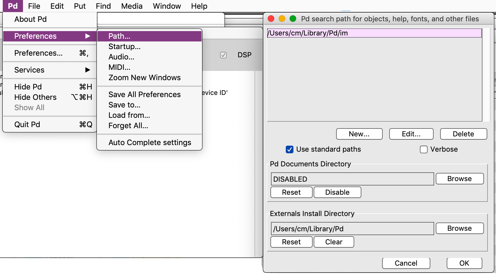
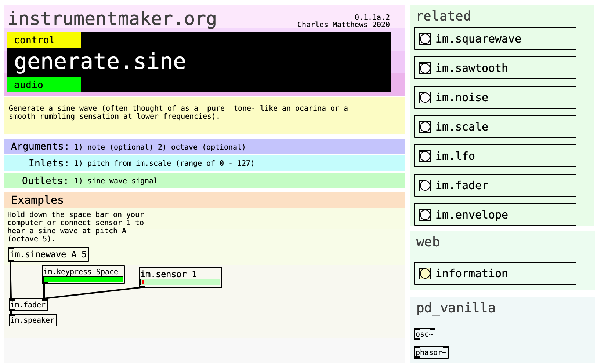
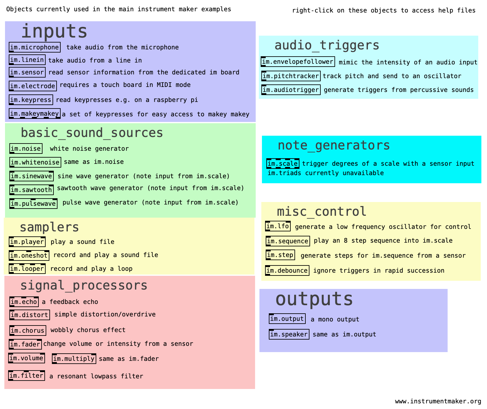
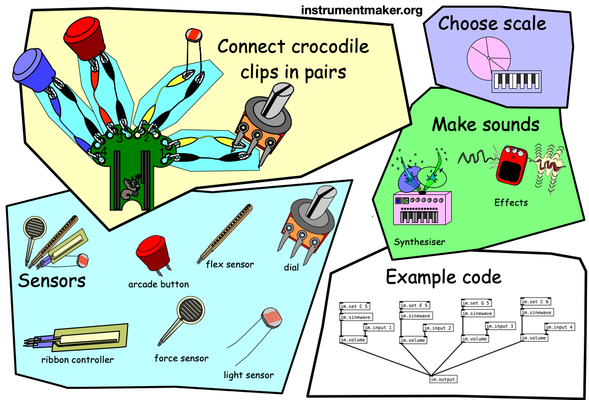

**Instrument Maker** is an open source framework for digital instrument building with sensors, featuring a library for running [Pure Data](http://puredata.info/) on embedded computers such as [Bela](http://bela.io) or [Raspberry Pi](https://www.raspberrypi.org/) + [Arduino](https://www.arduino.cc/).  

<!--Some rough documentation is being generated here: <https://instrumentmaker.org/im-reference/>.-->

# Key pages:

- [**IM-reference**](documentation/im-reference/index.html): **complete list of active objects**
- [**Learning Pd through Instrument Maker**](documentation/manual/learning-pd-through-im.md) (work in progress)
- [**GitHub repo**](https://github.com/matthewscharles/instrument-maker/)
- [**Instrument Maker Communication Symbols**](https://instrumentmaker.org/instrument-maker-symbols/)
- [**Wiki: development notes.**](https://github.com/matthewscharles/instrument-maker/wiki)  
  <!-- - **[Education Makers version](https://github.com/educationmakers/instrument-maker)** (development in an education technology context with Milieux Institute). -->

# About Instrument Maker

Instrument Maker is a tool for rapidly creating what is often described as accessible music technology (AMT), by using established programming languages and affordable hardware to create standalone instruments.  Its parameters have been chosen to reflect the options usually requested in music workshop settings: 

- quickly assignable musical scales/keys 
- flexibility around root notes and available ranges of notes
- chords 
- sampling 
- input from a range of interfaces such as distance sensors and switches

## How does it work?

Although Instrument Maker was designed as a complete workshop package including hardware, the main resource is a library of objects for [Pure Data](http://puredata.info/) that can be used independently.  We are currently looking for users to test and use the code before returning to a more integrated approach.

Having downloaded the library, create and connect building blocks in the form of obects with the `im.` prefix: e.g. inputs, outputs, tuning systems, processors, and synthesisers. 

Upload this code to Bela, or use a Raspberry Pi or laptop with an Arduino-type device connected.  

The software library is also great for live patching!

<iframe width="560" height="315" src="https://www.youtube.com/embed/IH1tZlbT3rA" frameborder="0" allow="accelerometer; autoplay; encrypted-media; gyroscope; picture-in-picture" allowfullscreen></iframe>
----

# Installation

***This is for our current demo setup for desktops/RPi. Deken release coming soon!***

We recommend using [Patchbox OS](https://blokas.io/patchbox-os/) for Raspberry Pi installations - once installed, follow the instructions below.

## **Recommended: direct download**

Download the latest release here, decompress somewhere in your user folder and follow the instructions for installation. 
https://github.com/matthewscharles/instrument-maker/releases

- Optional Bela download

The stripped-down Bela release is meant to function alongside the main library. Install the im folder as usual, and upload this folder with your _main patch to try it on the hardware. This is currently untested, and may be CPU intensive!  Use im.sensor with the argument input:A0 (A1, A2, etc.) to access the analog inputs. 

### **Alternative: clone this repo**

This has been the preferred option for collaborators, but realistically requires some knowledge of Git and/or terminal.

Download [GitHub Desktop](https://desktop.github.com/) and clone: https://github.com/matthewscharles/instrument-maker

- Clone the repo to a local folder by opening a terminal:

  `git clone https://github.com/matthewscharles/instrument-maker` Keep up to date by periodically typing `git pull` within the folder in terminal.  *On a Mac, you might be required to download developer tools in order to use Git. There is no need to install Xcode if prompted.*

- Download the repo folder

Click the green Clone or Download icon at the top of the [GitHub repo](https://github.com/matthewscharles/instrument-maker) to download a zip file.  If you choose this option, you will need to download updates manually in the future.

## **Installing Pure Data and linking folders**

- Install [Pure Data](http://puredata.info/downloads) Vanilla: <http://msp.ucsd.edu/software.html> (sorry, no Purr Data support yet).

  - *On a Mac, you may need to right-click on the downloaded application to open it without a security warning..*

- Copy the `im` folder to the existing search path in Pure Data (usually within your user/Library folder), load Pure Data. 

- Add the folder to the preferences.

  

- Find a list of objects by opening `_im-object-overview.pd` from the main folder

- Right-click on the objects found here to open help files.  This is a convention from Pure Data and similar languages - most help files contain editable examples!

  - Within the help files, you will find information on the relevant arguments, inlets, and outlets, related objects both within the library and in established approaches, whether the object expects or sends audio or control-type signals, and some basic examples to be copied and pasted.

  

### MaKey MaKey
This should be plug and play: use the im.keypress and im.makeymakey objects to experiment!

### Touch Board
Use a Bare Conductive Touch Board set to generic_midi_controller. This will connect to im.electrode and im.tb

### MIDI controllers
Set your MIDI controller to CC 0-7 on channel 1. This should work with im.sensor in the same way as our custom boards.

## Some notes on access

This work is ongoing - open source, and open process as far as we can make it.

We have developed hardware and web interfaces, but in the interest of some solid testing, our attention is on the underlying software library for now.  With time, the code itself should be a useful educational resource.

Much of this text will be written in shorthand and we recognise that this will be excluding to many people, but our goal is still to demystify and bring in the access longer term.

As we begin revisiting the web elements we also hope to start re-engaging with screen reader access and other often overlooked interfaces in this field..but we are not attempting to deliver a blanket solution by any means.

Distributed under the terms of the **[GNU Public license version 3](https://www.gnu.org/licenses/gpl-3.0.en.html)**.

## **Nothing about us without us**

Through this framework, we hope to ensure more people have direct access to the act of coding and customisation.  This is a tool made by and for our community, and we look forward to opening it up to a more inclusive approach.  

All too often in instrument development settings such as hackathons, it is assumed that the setup of a new instrument will be the domain of a specialist separate from a musician as an end user.  This can maintain a divide between specialists without lived experience of disability creating resources for disabled people.  We need more collaborative spaces.

The project was established by  [Charles Matthews](http://ardisson.net/),  [Gift Tshuma](http://www.utchoir.com/), and [Roybn Steward](https://www.robynsteward.com/music), starting from Gift's question: "can you give me a Pure Data demo lasting one minute, if it's supposted to be such an accessible way into building instruments?" (we're getting there).

We are also grateful for support from various organisations and inviduals - thanks page coming soon.  If you want to collaborate and/or can think of a way of helping us move forward, please get in touch.

Follow our collective project [Blurring the Boundaries](http://www.blurringtheboundaries.org/) for news of future events.  

## **"Accessible" does not always mean "easier"!**

This is not an attempt to make the process easier in a way that detracts from artistic integrity, nor is it an attempt to force independence! Rather, our intention is to establish options for more people to engage with the creation of music technology from more accessible starting points.  Access is different for everyone, but the barriers that we can remove often overlap.

---

Read more about the philosophy behind this framework on the [Bela.io blog](https://blog.bela.io/2019/08/20/towards-disabled-artist-led-music-technology-charles-matthews/).

---

Throughout this site you will encounter graphics playing on the classic "AAC" aesthetic often found in classrooms..find out more about this project here: [**Instrument Maker Communication Symbols**](https://instrumentmaker.org/instrument-maker-symbols/)

---

## How does this differ from regular Pd?

Our focus has so far on a separation between graphical interface and interactions - there are no on-screen objects that act as sliders or buttons, as we encourage users to work toward physical outcomes.  Of course, this decision in itself represents more access barriers, but we're working back toward something a bit more integrated.

Instrument Maker objects are named through something we feel is a bit closer to conversational "plain English", or rather the kind of language we might expect to use in a workshop setting with non-specialists.  That's not to say there is anything wrong with the abbreviations found in Pure Data and similar language, we're just trying to cut down on explanations for that initial experience.

Pure Data code relies on a user placing arguments immediately after an object name, in a particular order. Our latest updates introduce the idea of non-case-sensitive parameters that can be placed in any order.  We are also introducing more conventional units such as Hz, ms, and note names.

All Instrument Maker objects run at audio rate, and we have deliberately omitted the tilde (~) usually used to distinguish this process. However, for people running later versions of Pd, many objects will accept "control"-style messages.

### Why the im. prefix?

We wanted to avoid obscure names that might clash with existing Pd objects (thus pushing us into obscure IKEA-style naming conventions, but in our latest version we are starting to move toward plainer names.  

Some colleagues have noted that the im prefix is useful to indicate objects used separately as a beginner library.  By installing the IM folder within Pd's built-in search path, it's still possible to create `im/sensor` etc. with a slash instead of a dot.

Note: Instrument Maker is 100% Pd Vanilla. 

All of our objects are based on recombinations of the core Pd objects rather than C code, and so should work on libPd based platforms such as Bela without the need for any external libraries.  This also means that the back end should provide a field day for people learning to patch in more depth in Pd — but the legibility at this level is a longer term project!!

