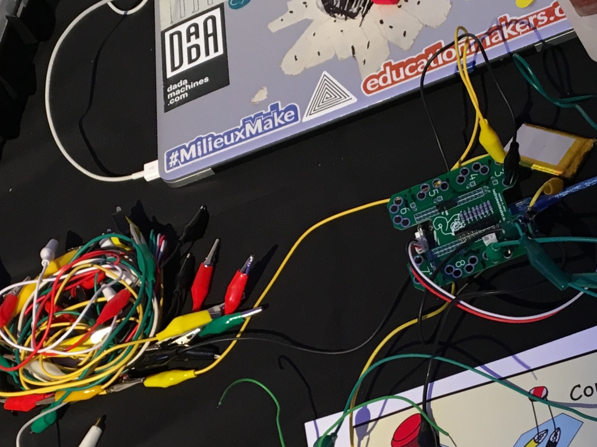

# Instrument Maker

This is an open source framework for digital instrument building with sensors, with improving access in mind. For [Pure Data](http://puredata.info/) running on [Bela](http://bela.io) / [Raspberry Pi](https://www.raspberrypi.org/) + [Arduino](https://www.arduino.cc/).  Code developed by [Charles Matthews](http://ardisson.net/), with workshops currently in development in collaboration with [Gift Tshuma](http://www.utchoir.com/) and more in the pipeline.  Get in touch if you would like to contribute!

An accompanying set of communication symbols can be found [here](https://github.com/matthewscharles/instrument-maker-symbols).

This document in itself is a work in progress, and an invitation to conversation.  [**Please access the wiki for more information and development notes.**](https://github.com/matthewscharles/instrument-maker/wiki)  

Distributed under the terms of the **GNU Public license version 3** (for now  / not sure how appropriate to this project / need to read up on this).

## Disclaimer

Instrument Maker is one of my first public repos, and will definitely be messy for a little while. I'm relatively new to Open Source culture - please call me out and/or help me understand if you disagree with anything on here.  Same goes for Disability and accessibility issues. 

About the code: the current version is not ready for public consumption (see the technical notes below); please feel free to explore the code, and download and try out the abstractions if you are familiar with Pure Data..but I recommend waiting a little while until everything's more coherent.

## How does it work?

To program: within Pure Data (pictured below), create objects with the `im.` prefix to access building blocks: e.h. inputs, outputs, tuning systems, and synthesisers. Upload to Bela, or Raspberry Pi with an Arduino-type device connected.  

Using Bela, choosing a setup should be a case of dragging and dropping into a browser; the Pure Data files can exist as templates or presets, no need to edit or look at the code unless desired.

Video demo (code): [https://youtu.be/8AJMJq2P8Ko](https://youtu.be/8AJMJq2P8Ko)

Video demo (mobile): [https://www.youtube.com/watch?v=jl020N0MZxk](https://www.youtube.com/watch?v=jl020N0MZxk)

Video demo (play): [https://www.youtube.com/watch?v=ywEX0N6TpEA](https://www.youtube.com/watch?v=ywEX0N6TpEA)

An accompanying hardware component is in development, which adds crocodile clip access to the Bela platform.

