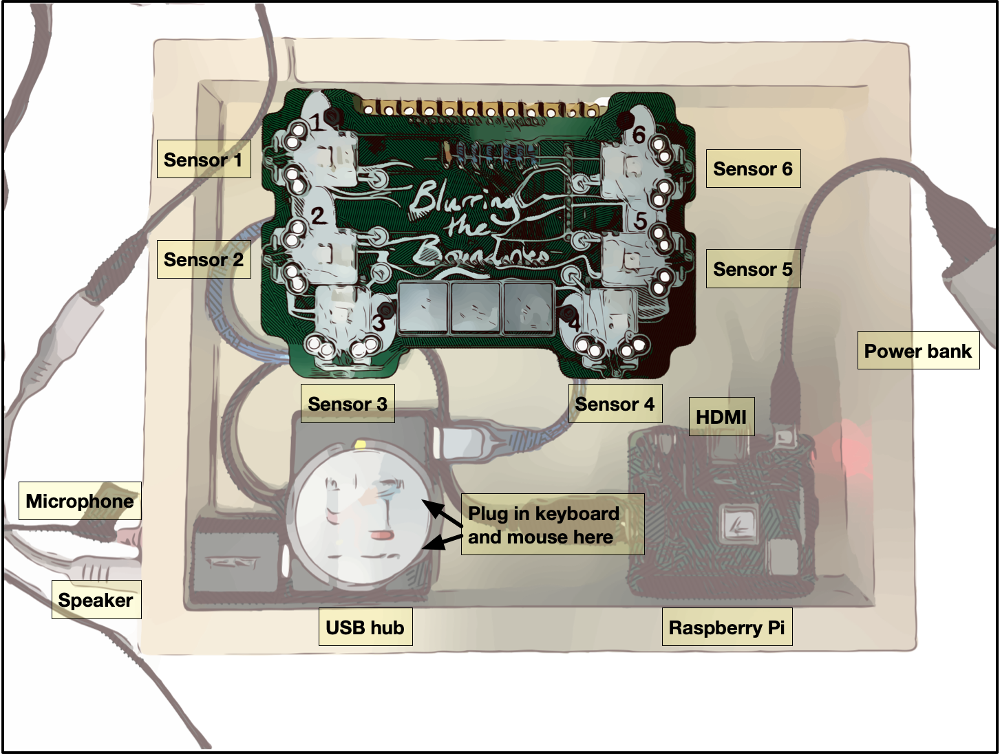
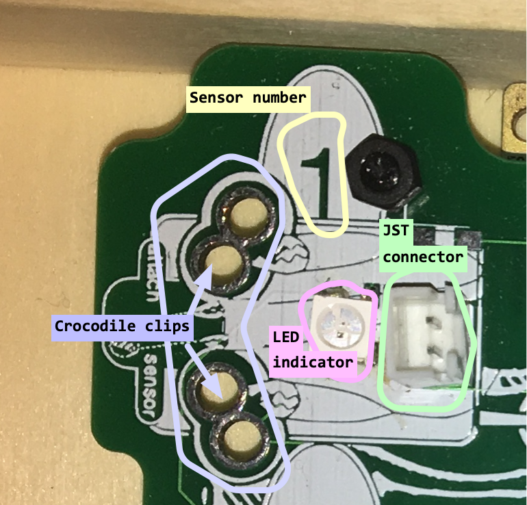
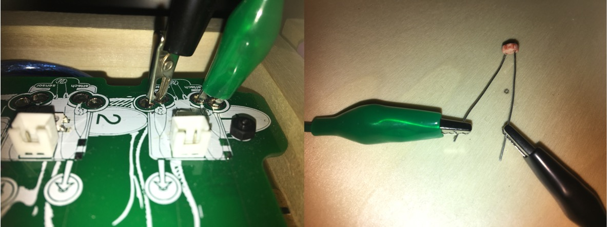
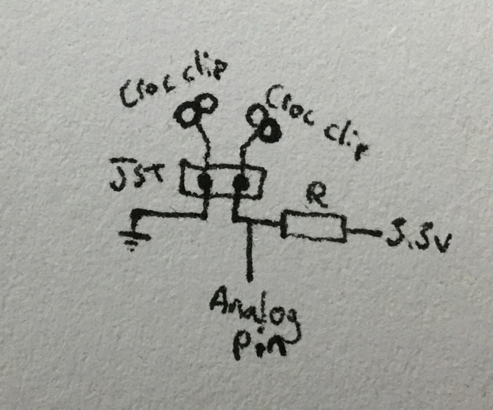
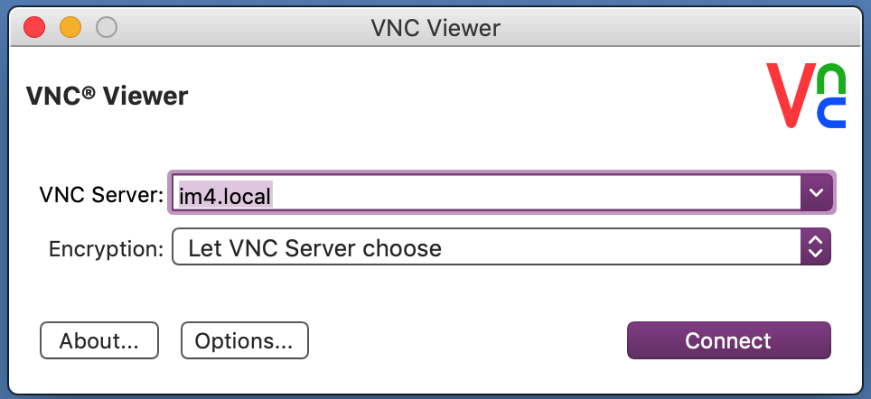

# IM Kits: basics

## Getting started/kit layout

The kits should "just work" (if not, please refer to the notes I sent via Google, and swap out the Arduino board/SD card).  Once USB power and a speaker have been connected, attaching a light sensor or arcade button to each sensor pair will result in a different note from the C major scale being played.  There shouldn't be any need to plug into a screen to hear the results.

If the SD card has been updated to the latest version, the output will be a bit different — try the first two sensors to make sound.

### "Sensor pair"? What's that?

The board is divided into six input areas:  

This is currently quite unclear on the current version, but will be replaced with something with higher contrast in the next batch!

Connect the crocodile clips like so:

If you don't have a sensor (or a flashlight) to hand, a simple switch can be tested by touching the ends of the crocodile clips together.  If the board is equipped with LEDs, the corresponding light should flash on when the clips connect.

For anyone that wants to know more, the pins are laid out as follows:

Sensor 1: A0

Sensor 2: A1

Sensor 3: A2

Sensor 4: A3

Sensor 5: A4

Sensor 6: A5

## Initial setup

### Cloning the Raspberry Pi disk image

Transfer the master SD card to a .img file, using these instructions:

Insert the SD card into a mac, and open a terminal window

Type `$ diskutil list`

Look for the name of the SD card (it should be `/dev/disk2` or `/dev/disk3`).  Enter the following, changing the name of `disk2` if necessary

`$ sudo dd if=/dev/disk2 of= ~/Desktop/imJanuary.img bs=1m`

*This can take up to roughly two and a half hours, and does not show a progress bar!*

Load [Balena Etcher](https://www.balena.io/etcher/) to flash a new SD card (at MilieuxMake this is installed on the iMac).  For this iteration, the SD card must be 32GB or larger.

The screen looks like this (choose imJanuary.img by clicking the Change button or dragging the icon from the desktop):

### Changing the hostname

Once the prepared SD card is inserted, plug the Raspberry Pi into a keyboard, mouse, and monitor to set it up.

Go to `Preferences -> Raspberry Pi Configuration` from the Raspberry Pi menu.

Change the hostname to something unique (I have used im1, im2 etc. so far to distinguish between the different kits).  Write this down!

## Connecting

If at all possible, these kits should be used wirelessly by setting up a personal hotspot on your mobile phone, or an Ad Hoc network on your desktop/laptop computer.  Set this up initially with a keyboard, screen, and mouse connected: change the wireless network by clicking on the WiFi logo on the top-right corner of the screen.  

Once connected, your wireless hotspot password should be stored; you may now disconnect the keyboard and mouse to edit your patch.

Connect VNC Viewer to `im4.local` (replacing `im4` with the hostname you set in the initial setup) to access the desktop remotely.   

Press `connect`, and when prompted, input: **username**: `pi` **password**: `im.possibl3`

You should now see the Raspberry Pi's screen as a window on your computer, and be able to edit the code.

## Updating the Instrument Maker library

The Instrument Maker library is kept on GitHub, and should be pre-loaded on the Raspberry Pi.  To update the library to its latest version, load a terminal on the Raspberry Pi, and type the following:

`$ cd instrument-maker`

`$ git pull`

The library should now be updated to the most recent version. 

*Please note that this might fail if using one of the earlier versions of the kits — if so, go back to initial setup.*

## Files for autoload on boot

Pure Data will load automatically upon booting the Raspberry Pi, regardless of whether or not a screen is plugged in.  This allows the Raspberry Pi to function as an embedded instrument.

Save your file as `test.pd` on the Desktop to make your patch load when the instrument boots up.

### Starting a fresh file

For the time being, it's best to keep working on `test.pd` — to start from scratch:

- press `ctrl` - `a` to select everything, and press `delete`.
- create a new object by pressing `ctrl` - `1`
  - type `im.pi` and click outside the box

Now create the rest of your patch according to the tutorials.  The `im.pi` object tells Pure Data to look for the Arduino board and use it as a MIDI controller.

# Troubleshooting

- There is no sound
  - Try connecting `im.microphone` to `im.speaker`, and make sure the microphone and speaker connections are still the right way around. 
  - Does the speaker still have batteries?  Is it switched on?
- The speaker is making an annoying beeping (telephone-style) noise! I didn't program that!
  - This means the speaker is running out of batteries.  You can charge it from the USB port, and I think it can still be used while it's charging.
- I clicked on an object, and now I have a page with more confusing networks of objects on it!
  - Oops - this means you were in performance mode rather than edit mode.  Close the window and press `ctrl` and `1` to create a new object, which automatically switches into edit mode.

# FAQ

**Can I use an Arduino board without the IM shield — i.e. with a breadboard?**

Yes, you just need to plug stuff in that works with the analog inputs for now, and make your own voltage divider circuit if necessary.

**Will the SD card work on other types of Raspberry Pi, e.g. the 3B+ with more USB ports?**

Yes! I'm using the A+ model because it's so affordable..

But we still need to use the same USB audio device, as it's written into the startup script.  This is a problem with running the devices headless (otherwise we need to go in to set the audio card every time), but it's worth the hassle to have a self-contained instrument..

**Why not use the built-in audio output on the Raspberry Pi?**

This was unexpectedly difficult to configure on the latest version of Raspbian.  Also, by using the USB sound devices, we automatically have a microphone input — even though it means we need to use a USB hub on the Raspberry Pi 3 A+!

**Why does the SD card need to be 32GB — isn't that a little big?**

That's the size I used at first, as I had planned to add some sample libraries, and the price was the same as a 16GB card..of course, I'm regretting this now as it takes quite a while to back up and flash a new card.  I will be working on something a lot smaller in the near future.

**Is it possible to connect to the Raspberry Pi with its own Ad Hoc WiFi?**

Working on it..but not yet.

**Can I use this with Firmata or a different Arduino sketch?**

Yes, in the near future.  This was the original plan, but I found it more stable to work with MIDI the way I have been so far.