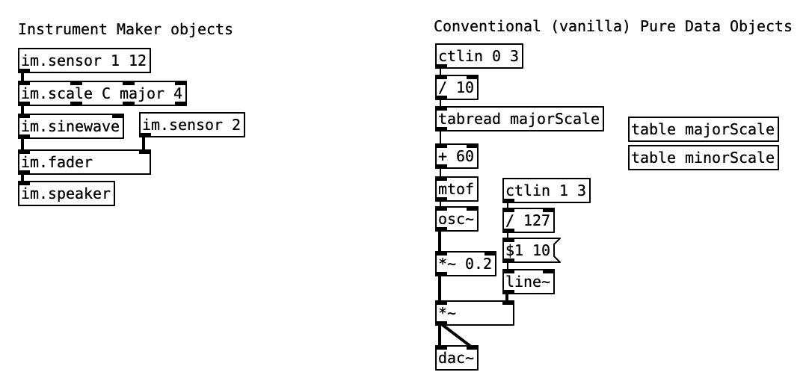
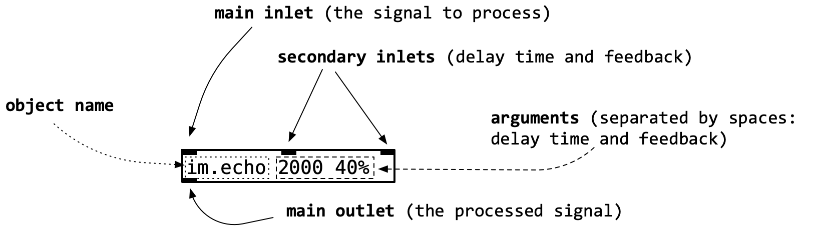
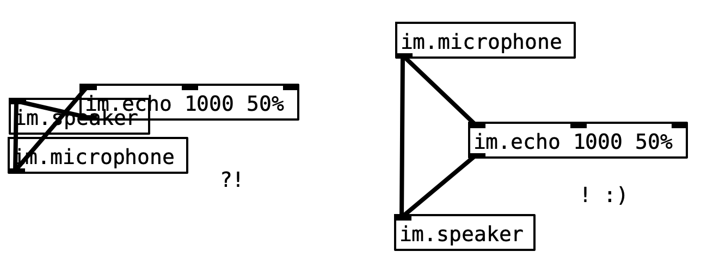
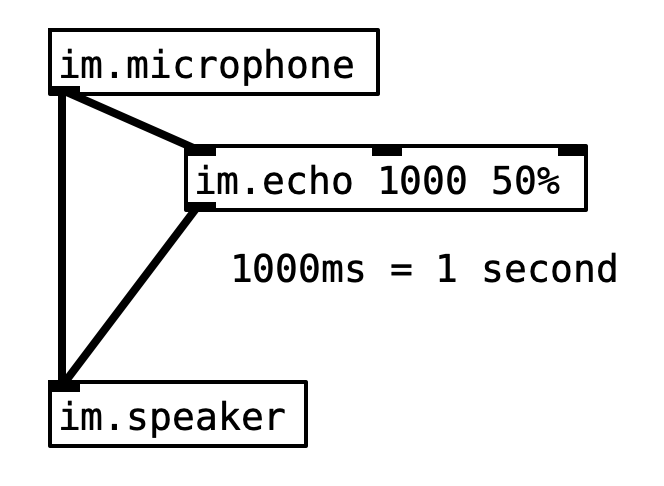
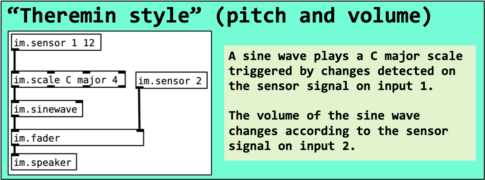
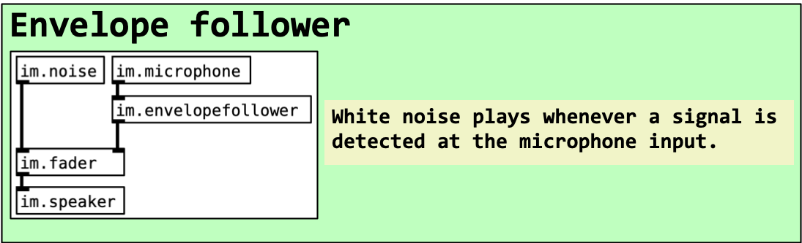
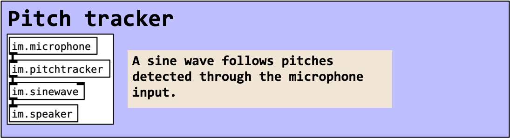
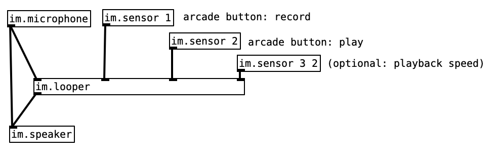
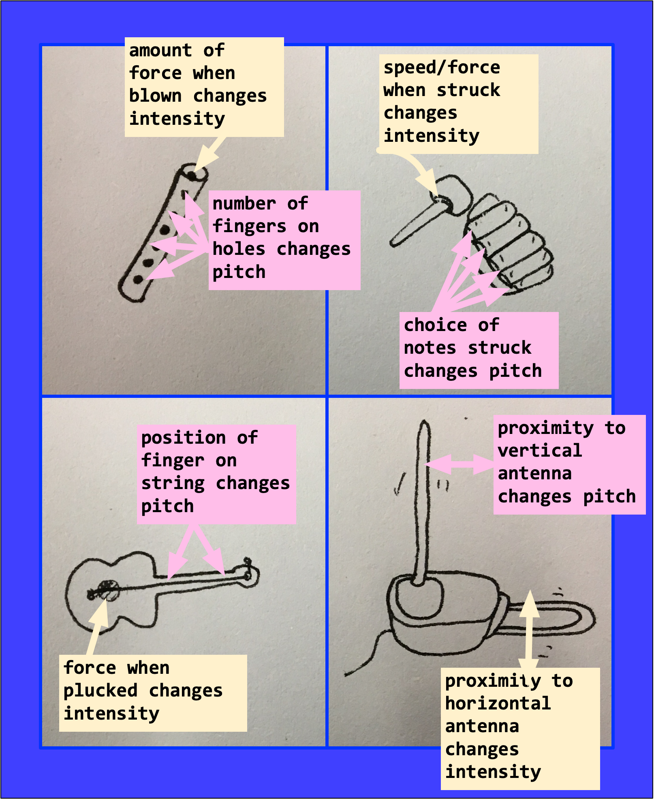
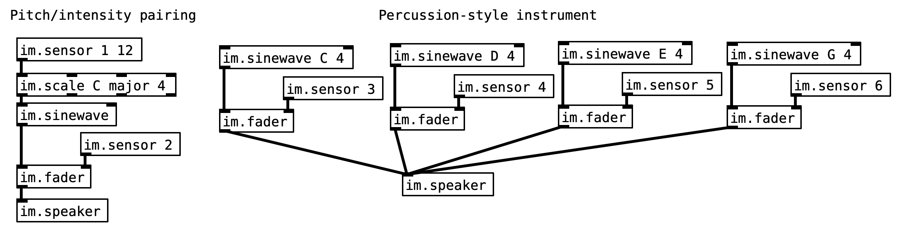

**Draft manual: Learning PD with Instrument Maker** 

Charles Matthews 2020

Incorporating contributions from Robyn Steward, Houda Jawhar, Ann-Louise Davidson (#MilieuxMake), Gift Tshuma (Blurring the Boundaries), and with thanks to countless others.  For now, you know who you are…(thank you)...

# Disclaimer and important info

The Instrument Maker library is very much a work in progress and a labour of love — so please don't be surprised if things change around! 

Make sure you have the most recent version of this document from [instrumentmaker.org](instrumentmaker.org), and update the software regularly by pulling from GitHub.  Since you're reading this, chances are you have one the Instrument Maker kits — you might also find this documentation useful: <https://github.com/matthewscharles/instrument-maker/blob/master/documentation/manual/imkits.md>

If you have any issues with the software, including requests for clarity or additions to this documentation, please use the issues forum: <https://github.com/matthewscharles/instrument-maker/issues>.

This manual is currently presented a raw MarkDown document.  As a result, the images vary wildly in size and quality, as does the general layout.  Please bear with this for now!   [Experimental  documentation/help files](https://instrumentmaker.org/im-reference/) generated automatically from JSON is also in progress, but will take time to finish up.

# Introduction

## What is PD (Pure Data)?

[Pure Data](http://puredata.info/) (PD for short) is a free, open source [dataflow](https://en.wikipedia.org/wiki/Dataflow_programming) programming language. 

- Create and connect graphic objects on-screen, rather than writing lines of text code.
- Pure Data is friendly to many musicians because it can feel similar to connecting instruments and effect pedals.
  - By changing the order in which the pedals (or objects) are connected, we can change the sound produced.
  - Sometimes this way of organising information can lead to a more playful approach.

### Why use Pure Data?

Pure Data is free and open source, meaning that members of the community can edit the code and create their own versions of the software.

Pure Data code can be applied in a variety of music making contexts, including [the web](https://github.com/sebpiq/WebPd), [audio apps for Android and iOS](http://danieliglesia.com/mobmuplat/), and running on embedded computers like the [Raspberry Pi](https://puredata.info/docs/raspberry-pi) and [Bela](http://bela.io/).

## What is Instrument Maker?

Instrument Maker is a toolkit designed for making music quickly with sensors.  This includes a library for Pure Data: a set of objects that have been designed as an introduction to audio coding. 

The core aim is to enable beginners to make a wide range of sounds in a musical context, within a matter of minutes. The user should receive a basic idea of how dataflow programming works, but fulfil the goal of making sound with some commonly accepted musical qualities (e.g fitting to the notes of a scale) as soon as possible.  It is then up to the individual to decide whether they wish to dig deeper into the programming itself.

Here's an image comparing the Instrument Maker library with objects that come with Pure Data "out of the box".  Both patches perform the same function:

Instrument Maker objects can be used alongside regular Pure Data objects, so that the transition to usual Pure Data objects can take place gradually. In the future, there will be a section dedicated to this toward the end of this document.  

By itself, the Instrument Maker library is intended to be used purely in the "back end" of a program, separating the graphical interface from the code.  This idea might be counter intuitive to experienced PD users and teachers!

There are also Instrument Maker boards available to simplify the hardware construction process in a similar manner.  If you're reading this document, you probably have one of these boards. Alongside these resources, we hope to add other functionality to address the absence of screenreader support, switch access to to the software etc.

# Hardware resources

At present, the Instrument Maker code functions best with the following items:

- [Bela](https://bela.io/) 
- [Raspberry Pi](https://www.raspberrypi.org/), connected to [Arduino](http://arduino.cc/) (best support with Leonardo, [Bare Conductive Touch Board](https://www.bareconductive.com/shop/touch-board/), or other 32u4 based board for [native USB MIDI](https://www.arduino.cc/en/Tutorial/MidiDevice)) or [Micro:Bit](https://microbit.org/) (resources currently in development)

Although these hardware resources can be used to control motors, lights, and other outputs, at present the Instrument Maker library is designed to work one way: to convert sensor information into audio signals (whether you prefer to think of this as vibration, sound, or music). 

Therefore, it's safe to assume that any external connections mentioned below (apart from microphones and speakers) are sensor inputs. 

## Operating without the Instrument Maker hardware

*Example Arduino code coming soon — link to end of document.*

# Anatomy of a Pure Data object

Each object has a **name**, **arguments**, **inlets**, and **outlets**:

## Object name

All objects must have a name, which determine their function. Objects from the Instrument Maker library start with the letters **im.**

## Object arguments

Arguments are numbers (or occasionally words) that provide the object with more details on how to operate. For example, having named an `im.echo` object, we can also set its time (how short or long the echo is), and the amount of feedback (affecting how many times the echo repeats). 

Arguments in Pure Data are written after the name of the object, and separated with spaces.

Each argument affects a different parameter.  The arguments must be written in the correct order.

### Comparison with other languages

Unlike more contemporary languages such as Swift, the names of arguments are not written down, meaning that the user must remember what each argument does (and the order in which they need to be written), or consult a reference (once it has been written properly..I know..).  For people that have worked with other (text-based) programming languages, it might be useful to picture an object and its arguments like this: 

`name(argument, argument)`

Therefore, more concretely: `sensor 1 12` would be equivalent to `sensor(1, 12)` in a text based language — *read the sensor connected to pin 1, and multiply the output by 12*.

`scale C major 3` would be equivalent to `scale(C, major, 3)` — *process the incoming signal as a scale with root note C, using a major key, starting at octave number 3*.

## Inlets and outlets

Information flows one way in Pure Data: downwards. Inlets can only be connected to outlets -- an inlet can not be connected to another inlet. When clicking and dragging to create connections, the connection must always be started from the outlet.

<!--- parentheses example --->

Not all objects have the same numbers of inlets or outlets. Furthermore, some might only have an inlet or an outlet.  For example, the im.speaker object only has an inlet, because the output takes place in the physical world.

In general, the left-most inlet is the most important — this is where the primary signal to process should be sent through.  Other inlets 

Multiple objects can be connected to each other -- so, for example, a single sensor input can be used to control several sounds or parameters. 

*Note: since the Instrument Maker library is a work in progress, some of the inlets and outlets don't have an obvious function — they've been left in for testing purposes or for future features.  For example, the scale object only really handles information in its main inlet and outlet.*

# First steps in Pure Data 

This tutorial assumes you are running Pd v0.49 upward on a Raspberry Pi.  

*Mac users should change `ctrl` to the `CMD` key.*

## Creating and connecting objects 

### Creating an object

Press **`ctrl`** and **`1`** on the computer keyboard, or go to the **`put`** menu at the top of the window and choose **`object`**.

Type the name of the object into the box.

Type any arguments required, making sure you include spaces.

Click on the background (anywhere outside the object) to finish the box. 

#### Troubleshooting

If there is a problem with the object, the box will appear with a dotted outline.  There are a few likely reasons for this:

- there is no object with the name you used (make sure the Instrument Maker library is installed, and that you have spelled it correctly)
- there are capital letters somewhere in the object name — almost all object names are lower case
- there are spaces missing between the object name and arguments

### Editing an object

Click on the object to place the text cursor, and type your changes in.  Click outside the object to close the box.

Resize the object by moving the mouse pointer over the object's right-hand border, and dragging.

Move objects by dragging on them with the mouse (don't click on them first — the software will think that you are trying to edit the text!).  

### Connecting objects

Click and hold the mouse cursor over an outlet to start the connection. As you move the mouse over the outlet, the pointer should turn into a circle.

Keep holding the mouse button down while you drag onto the inlet of a second object.  You should see a black line extending, and the mouse pointer will turn into a finger.  When the pointer is over a compatible inlet, it will turn back into a circle, and you can let go.

### Shortcuts and tips

Instead of clicking on the background, press **`ctrl`** and **`1`** while the box is still highlighted to create another object — the next object will be connected automatically.

Instead of creating a new object, you might wish to select an object and press **`ctrl`** and **`d`** to duplicate it.  This can be useful if you are creating similar chains of objects.  

Move the objects around to make space for your objects on screen — try not to cram them in too tightly!

## Basics: connecting a microphone

Create a microphone object (`im.microphone`)

Create a speaker object (`im.speaker`)

Join the microphone and speaker with a cable: click and drag from the outlet on the bottom of the microphone object, and connect it to the inlet at the top of the microphone object.

### Adding an effect

Create an `im.echo` object, with delay time in milliseconds and feedback amount.

Connect the echo as a send effect:make a second cable from the im.microphone object, and connect it to the input of the echo (the left side).  Connect the output of the echo directly to the speaker.

# Examples

Depending on interest of the user, the following are recommended starting points for using Instrument Maker:

- **"Theremin style"**

  

- **Envelope follower**

  

- **Pitch tracker**

  

- **Loop pedal**

  

# Key im objects

Placeholder — work in progress!

## im.sensor

***No inlet***

**Outlet:** sensor reading

**Arguments:**

1. the name or number of the input to read from
2. multiplier

The multiplier can be used to set how many notes are played (when combined with im.scale)

## im.speaker

**Inlet:** the signal to go to the speaker

**Outlet:** no outlet

***No arguments***

No 

# Key concepts

Placeholder — work in progress!

## Signal flow

The order in which objects are connected affects their sound and/or behaviour. 

Unlike a physical circuit, the information flows in a linear fashion from the top to the bottom of the screen, and does not need to return to its start point.

### Effects: inserts and sends

Effects can be thought of as being inserted in series or parallel with their original sound.

An "insert" replaces a signal with its effected version ("in series"). 

A "send" (also known as an auxiliary or aux send) involves a signal being duplicated, with an effect applied ("in parallel"). 

## Instrument elements

Interactions with live instruments can often be divided up into controlling **pitch** and **intensity/loudness**.  These two parameters make a good starting point when designing an electronic instrument.  For example:

The main difference in these examples can be found in percussion instruments (like the gamelan example above, or playing a piano-style keyboard): in these cases, each note is a fixed in a specific place, and so the player changes the volume by striking it.

All of these interactions can be approximated through a combination of sensors; the controls can even be shared to create a collaborative instrument that must be played by two people (one person taking pitch, the other taking volume/intensity.  

Other examples include:

- "pitch and velocity pairs" in MIDI instruments
- bowing a string instrument while changing pitch on its neck
- scratching a record on a turntable while changing volume with the crossfader 

*Placeholder: flute example*

# Making the transition from Instrument Maker

Placeholder — work in progress!

## Pure Data

So far, the objects we have been using from the Instrument Maker library have all worked with audio signals.  In more general practice, Pure Data makes distinctions between messages and signals — and the name of the objects using audio signals are marked with a tilde: `~`

- Sequencer
- Stereo with dac~
- MIDI control

## Arduino and physical circuits

- Voltage divider circuit

# Glossary

The following rough definitions are simplified and adapted to context.

- **Abstraction** — a Pure Data patch that has been saved and loaded as an object.
- **Amplitude** — the strength of a signal (often equivalent to volume)
- **Arduino** — a circuit board computer that can be programmed to receive sensor data, control actuators, and  can be embedded in devices.  Arduino boards are designed for education, e.g. not to catch fire if you accidentally create a short circuit.
- **Arduino** — a type of open source hardware board with inputs and outputs that can be connected to a computer (also refers to the accompanying software and the company that makes it).
- **Aux** — another word for a send effect.
- **Bela** — a type of open source hardware board, with inputs and outputs, that can run Pure Data with very low latency.
- **Chain** — a series of objects or processes, connected one after the other.  
- **Chord** — a combination of pitched sounds.
- **Circuit** — a phsyical path through which electricity passes, connecting various components.
- **Controller** — a physical device that affects parameters of sound, e.g. on a computer or synthesiser, but does not produce sound itself.
- **Crossfade** — to change the amplitude of two signals in inverse proportion to each other (i.e. one moves up when the other is moved down).
- **Dataflow** — a style of programming that uses the visual metaphor of a signal flow chart to connect blocks of code together.
- **Distortion** — a kind of squashing of a sound, which often makes it appear louder, and perhaps rougher in quality.
- **Dry (signal)** — a signal without an effect (in contrast to wet, leading to description of "dry/wet" balance). 
- **Echo** — an effect based on the repetition of a sound, often more than once if the sound is fed back onto itself.
- **Effect** — something that changes the quality of a sound, e.g. echo, reverb, or distortion
- **Electrode** — a conductive material that serves as an entry or exit point for electricity in a circuit — in this context, the twelve touch points on a Touch Board.
- **Envelope** — a set of instructions that change something over time: for example, the volume of a sound fading in and out.
- **Envelope follower** — a process that measures the volume of a sound, and uses this information to generates changes in another parameter.
- **Fade** — to bring volume (or another parameter) up or down
- **Fader** — a control that turns something up and down, most commonly found in the volume controls for each channel on a mixing desk. 
- **Feedback** — placing a sound back onto itself, like holding a microphone to a speaker into which it is plugged.
- **Frequency** — how fast something repeats — higher frequencies are perceived as pitches, while lower frequencies are perceived as rhythmic movements.
- **Filter** — a process that removes certain qualities of a sound (e.g. high or low frequencies).
- **FM synthesis** — a type of synthesis that uses frequency modulation to create new textures.
- **Granular synthesis** — a technique used to create textures by slicing sounds into small pieces, repeating and recombining them.
- **Hz** — a unit of measurement for frequencies: cycles per second. 
- **Inlet** — the part of an object that takes data in, sitting at the top of the object.  Different types of objects have different numbers of inlets — some have none!
- **Insert effect** — a way of adding effects by cutting directly into the signal, replacing the original "dry" sound.
- **Interval** — the distance between two points — in musical programming, we often need to think of intervals in terms of rhythm (how long between two events, perhaps as a whole note, quarter note etc.) or in terms of pitch (how many notes fit between two notes in a scale).
- **Key (musical)** — see scale.
- **Latency** — the amount of time it takes to process a sound (e.g. the time it takes for a sound to be triggered when a button is pushed).  Latency changes depending on how fast or efficient a computer is at handling audio.
- **Loop** — a repeated sound or pattern
- **Looper** — a device or object that records a live sound and plays it back repeatedly (often to provide a background texture). 
- **LFO** **(Low Frequency Oscillator)** — an oscillator with a frequency so slow/low that it is perceived more in terms of rhythm than pitch, usually used to modulate parameters of other sounds.
- **Major** **(scale)** — a common scale (the same as the ionan mode).
- **Milliseconds (ms)** — a unit of time most commonly used in processing: a thousandth of a second.
- **Minor** — a common scale (the same as the aeolian mode, kind of..)
- **MIDI** — Musical Instrument Digital Interface: a convention used to send instructions from one synthesier or software program to another (e.g. turning notes on and off), without sending the sound itself.
- **Mixer** — a device used to blend sounds by changing their individual volumes or tone, usually using sets of faders or dials
- **Mode** **(musical)** — a scale that starts on a different key to the usual root note, so that intervals have different weighting. Common modes — included in the IM library — are:
  - ionian (major)
  - dorian
  - phrygian
  - lydian
  - mixolydian
  - aeolian
  - locrian
- **Object** — a block of code represented as a box 
- **Octave** — an interval of twice a given frequency or pitch.
- **Oscillator** — something that moves back and forth to produce a regular wave
- **Outlet** — the part of an object that sends data out, sitting at the bottom of the object.  Different types of objects have different numbers of outlets — some have none!
- **Native USB MIDI** — a quality of a device that enables it to appear as an instrument input on the computer without another program needed to mediate the connection.
- **Noise** — a sound without a clear sense of pitch.
- **Parameter** — something that can be measured and/or altered to express the quality of a sound or process
- **Physical modelling** — a type of synthesis in which real-world acoustic qualities of a sound or instrument are mimicked using combinations of electronic processes
- **Patch** — a program written in Pure Data.
- **Pitch** — how "low" or "high" a sound is, usually associated with frequency.
- **Pitch tracker** — a process that measures the pitch of an input and sends this data to other parameters (e.g. the pitch of another sound).
- **Plugin** — a smaller piece of software that is added on to expand a music program (for example, adding a certain instrument or effect). Plugins often work with many different pieces of software. 
- **Reverb** — short for *reverberation*: the reflections of an acoustic space (often simulated digitally), which can give sounds longer tails proportional to the size of the room. 
- **Resistor** — a component that causes resistance in a circuit and thus lowers the voltage at a given point.
- **Root (note)** — the first note of a scale
- **Sample** — a recorded sound
- **Sampler** — a device that records and/or plays sound 
- **Sawtooth (wave)** — a wave shaped like a saw — unfiltered, this produces a buzzing sound or vibration
- **Send effect** — an effect that takes a copy of a sound, leaving the original sound intact (see aux send).  This could be described as the objects being chained in parallel, rather than in series.
- **Sensor** — a material that measures something in its surroundings (e.g. light, sound, temperature), which can be transferred to the computer by reading its voltage.
- **Signal flow** — the path that an audio signal takes from its input (e.g. 
- **Sine (wave)** — a "pure" tone: air moves like semicircles.  This produces a smooth sound like a flute or recorder. 
- **Speaker** — a device that converts electronic signals into sound waves, usually by pushing a cone back and forth to make the air around it vibrate.
- **Sub-patch** — a patch within a patch — it's possible to create your own objects with inlets and outlets, consisting of Pure Data code.
- **Scale (musical)** — a set of notes (e.g. major, minor, blues).
- **Theremin** — an electronic instrument which changes its pitch and volume, depending on how close the player's hands are.
- **Touch Board** — a type of Arduino board (made by Bare Conductive), which enables easy capacitive sensing
- **Triad** —a chord consisting of three notes.
- **Wet (signal)** -- a sound with an effect (in contrast to dry, without the effect). 
- **White noise** — a sound presenting all frequencies at equal loudness. 
- **Velocity** — the force with which a note is played (usually linked to the loudness)
- **Vibrotactile** — something that transmits vibrations through touch
- **Volume** — a measure of how loud and/or intense a sound is.
- **Voltage divider** — a circuit used to measure the voltage by taking a reading between two resistors.

# References/learning resources

Please note that it may be confusing to jump back and forth between this documentation and these other resources — a transition document is currently under development.

- [Programming electronic music in Pd](http://www.pd-tutorial.com/) (Johannes Kreidler)
- [Designing Sound](https://mitpress.mit.edu/books/designing-sound) (Andy Farnell) — tutorial PDF [here](http://aspress.co.uk/ds/pdf/pd_intro.pdf)
- [Pure Data and Bela](https://blog.bela.io/2019/03/06/pure-data-and-bela/) (Robert Jack)

# Notes for experienced PD users

Objects in the Instrument Maker library are based on audio connections — at present, there aren't really any traditional messages in use.

The im.sensor inputs are actually MIDI CC inputs converted to audio!  This is intended to create continuity between working with the Raspberry Pi and Bela (which presents sensor inputs as audio).

There are only two elements available: objects and cables.  This reinforces a deliberate separation of interface and code. Users are not encouraged to use GUI objects (including messages) in the initial stages, which might feel counter-intuitive to some people!

This also means that we can stay in edit mode 100% of the time..avoiding opening the abstractions by accident.

Instrument Maker objects are created in Vanilla for maximum compatibility — they are all abstractions!

Input is roughly equivalent to "pin" on an Arduino or Bela board.